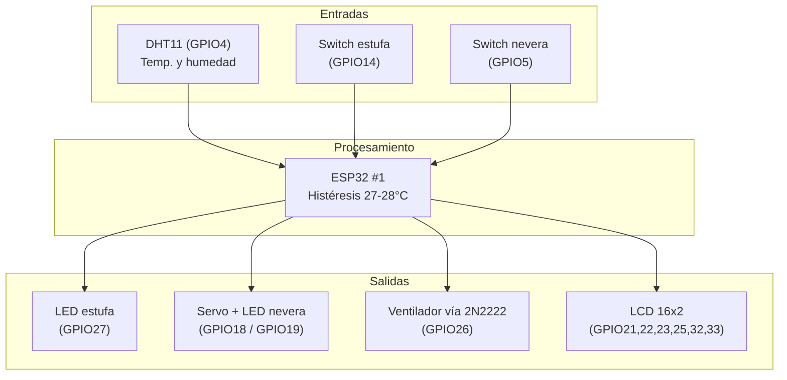
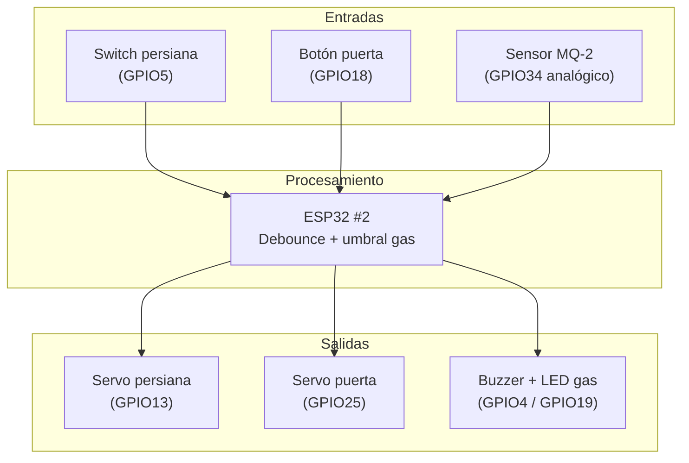

# Sistema de Cocina Inteligente con ESP32

Proyecto de laboratorio de microcontroladores — Universidad Militar Nueva Granada.
Automatización de una maqueta de cocina mediante **dos ESP32 independientes**, cada uno encargado de un subsistema distinto.

## Tabla de contenido

- [Descripción general](#descripción-general)
- [Elementos del proyecto](#elementos-del-proyecto)
- [Arquitectura del sistema](#arquitectura-del-sistema)
- [Explicación del código](#explicación-del-código)
- [Conexionado (pines)](#conexionado-pines)
- [Instalación y librerías](#instalación-y-librerías)
- [Simulación en Wokwi](#simulación-en-wokwi)

## Descripción general

El proyecto simula la automatización de una cocina doméstica. Se divide en dos módulos que trabajan de forma **independiente y simultánea**, cada uno en su propio ESP32:

| Módulo | Función | Archivo |
|---|---|---|
| **ESP32 #1 — Ambiente de cocina** | Control de estufa, nevera (con apertura simulada por servo) y ventilación automática según temperatura, con reporte en pantalla LCD | `esp32_cocina_versionfuncional.ino` |
| **ESP32 #2 — Seguridad y acceso** | Control de persiana automatizada, puerta automatizada y detección de fuga de gas con alarma sonora/visual | `esp32_persiana_versionFuncional.ino` |

No hay comunicación entre los dos ESP32: son subsistemas desacoplados que comparten la misma maqueta física pero no intercambian datos entre sí. Esta decisión de diseño simplifica el cableado y aísla fallos (si un módulo se reinicia, el otro sigue funcionando).

## Elementos del proyecto

### Módulo 1 — ESP32 #1 (cocina)

| Elemento | Cantidad | Función en el sistema |
|---|---|---|
| ESP32 DevKit | 1 | Unidad de procesamiento |
| Sensor DHT11 | 1 | Lectura de temperatura y humedad ambiente |
| Interruptor (estufa) | 1 | Simula el encendido manual de la estufa |
| Interruptor (nevera) | 1 | Simula la apertura de la puerta de la nevera |
| LED | 2 | Indicador visual de estufa encendida y nevera abierta |
| Servomotor SG90 | 1 | Simula el mecanismo de apertura de la puerta de la nevera |
| Transistor 2N2222 | 1 | Actúa como interruptor electrónico para excitar el ventilador desde una salida digital del ESP32 |
| Ventilador DC | 1 | Ventilación automática por temperatura |
| Pantalla LCD 16x2 | 1 | Muestra temperatura, humedad y estado del ventilador en tiempo real |

### Módulo 2 — ESP32 #2 (persiana, puerta y gas)

| Elemento | Cantidad | Función en el sistema |
|---|---|---|
| ESP32 DevKit | 1 | Unidad de procesamiento |
| Switch de palanca (persiana) | 1 | Define la posición deseada de la persiana (fija, no momentáneo) |
| Servomotor SG90 (persiana) | 1 | Mueve la persiana entre abierta/cerrada |
| Pulsador (puerta) | 1 | Alterna el estado abierta/cerrada de la puerta |
| Servomotor SG90 (puerta) | 1 | Mueve la puerta entre abierta/cerrada |
| Sensor MQ-2 | 1 | Detección de gas/humo (fuga de gas en la cocina) |
| Buzzer | 1 | Alarma sonora ante fuga de gas |
| LED | 1 | Alarma visual ante fuga de gas |

## Arquitectura del sistema

El sistema sigue una arquitectura clásica de control embebido: **entrada (sensores) → procesamiento (ESP32) → salida (actuadores)**, replicada dos veces de forma independiente. A esto se le suele llamar arquitectura de **"lazo de control de barrido continuo" (polling loop)**: en cada vuelta del `loop()` el ESP32 lee todas sus entradas, decide con lógica condicional/histéresis y actualiza sus salidas — sin interrupciones por hardware ni sistema operativo de por medio.

### Diagrama de bloques — ESP32 #1 (cocina)



### Diagrama de bloques — ESP32 #2 (persiana, puerta, gas)



### Análisis de la arquitectura

- **Desacoplamiento por módulo**: cada ESP32 gestiona un dominio funcional propio (clima/electrodomésticos vs. seguridad/acceso). Esto reduce la complejidad de cada programa y permite trabajar y depurar cada parte por separado.
- **Patrón entrada–proceso–salida repetido**: ambos módulos comparten el mismo patrón de diseño, lo que facilita explicar y sustentar el proyecto con un único modelo mental, aunque cada uno resuelva un problema distinto.
- **Manejo de tiempo no bloqueante**: el módulo 1 usa `millis()` para espaciar las lecturas del DHT11 (en vez de `delay()`), y el módulo 2 usa `millis()` para el antirrebote (debounce) de sus entradas digitales. Esto evita que el ESP32 se "congele" mientras espera, dejando el `loop()` libre para atender el resto de tareas.
- **Histéresis en el ventilador**: en vez de un único umbral de temperatura, se usan dos (28 °C para encender, 27 °C para apagar) para evitar que el ventilador oscile rápidamente cuando la temperatura está justo en el límite.
- **Lectura directa de posición vs. conteo de toggles**: el switch de la persiana se lee de forma directa en cada ciclo (su posición física siempre determina el estado del servo), mientras que el botón de la puerta funciona como un basculador (toggle) porque es un pulsador momentáneo. Esta diferencia de tratamiento entre un switch fijo y un pulsador es una decisión de arquitectura importante para sustentar.
- **Seguridad ante fallos del sensor**: si el DHT11 no responde, el sistema apaga el ventilador por defecto (falla segura) en lugar de mantener un estado indeterminado.
- **Promediado de muestras (MQ-2)**: se toman 5 lecturas analógicas y se promedian antes de comparar contra el umbral, para filtrar ruido y evitar falsas alarmas de gas.

## Explicación del código

### `esp32_cocina_versionfuncional.ino` (ESP32 #1)

#### 1. Librerías incluidas

```cpp
#include <LiquidCrystal.h>
#include <DHT.h>
#include <ESP32Servo.h>
```

- `LiquidCrystal.h`: maneja la pantalla LCD 16x2 en **modo paralelo de 4 bits** (RS, Enable y 4 líneas de datos). No usa el bus I2C, por eso se declaran 6 pines individuales en vez de solo SDA/SCL.
- `DHT.h` (Adafruit): abstrae el protocolo propietario de un solo cable (*one-wire*) que usa el DHT11 para entregar temperatura y humedad.
- `ESP32Servo.h`: es necesaria porque la librería `Servo.h` estándar de Arduino no es compatible con la arquitectura del ESP32; esta versión genera la señal PWM de 50 Hz que esperan los servos SG90 usando el hardware del ESP32.

#### 2. Definiciones de pines y constantes (`#define`)

```cpp
#define DHTPIN 4
#define DHTTYPE DHT11
#define LED_ESTUFA 27
#define INTERRUPTOR_ESTUFA 14
#define SERVO_PIN 18
#define LED_NEVERA 19
#define INTERRUPTOR_NEVERA 5
#define PIN_VENTILADOR 26
#define LCD_RS 21
#define LCD_E 22
#define LCD_D4 23
#define LCD_D5 25
#define LCD_D6 32
#define LCD_D7 33
```

Cada `#define` asocia un nombre legible a un número de GPIO físico. Se usan constantes de preprocesador (no variables) porque su valor nunca cambia durante la ejecución y así el compilador las sustituye directamente, sin costo de memoria RAM.

```cpp
#define TEMP_ENCENDER 28.0
#define TEMP_APAGAR   27.0
#define INTERVALO_DHT 2500
```

Estas tres son los **parámetros de comportamiento** del sistema: el umbral alto y bajo de la histéresis del ventilador, y el tiempo mínimo (en milisegundos) entre dos lecturas del DHT11 (este sensor no puede leerse más rápido de ~1 vez por segundo sin dar errores, por eso se deja un margen de 2.5 s).

#### 3. Objetos globales

```cpp
DHT dht(DHTPIN, DHTTYPE);
LiquidCrystal lcd(LCD_RS, LCD_E, LCD_D4, LCD_D5, LCD_D6, LCD_D7);
Servo servoNevera;
```

Se crea un objeto por cada periférico "inteligente". Esto es programación orientada a objetos básica: en vez de manipular registros directamente, se llama a métodos como `dht.readTemperature()`, `lcd.print()` o `servoNevera.write()`.

#### 4. Variables de estado

```cpp
unsigned long ultimaLecturaDHT = 0;
bool ventiladorEncendido = false;
```

- `ultimaLecturaDHT` guarda el valor de `millis()` (tiempo desde que arrancó el ESP32) de la última vez que se leyó el sensor. Es la base del **temporizador no bloqueante**.
- `ventiladorEncendido` es la "memoria" del estado actual del ventilador; es indispensable para la histéresis, porque la decisión de la próxima vuelta del `loop()` depende de en qué estado estaba antes, no solo de la temperatura actual.

#### 5. `setup()` — configuración inicial

Se ejecuta **una sola vez** al encender o resetear el ESP32:

- `pinMode(PIN_VENTILADOR, OUTPUT)` + `digitalWrite(..., LOW)`: el ventilador arranca apagado, nunca en un estado indefinido.
- `pinMode(INTERRUPTOR_ESTUFA, INPUT_PULLUP)` y lo mismo para la nevera: se usa la resistencia de *pull-up* interna del ESP32, así el interruptor solo necesita conectar el pin a GND para activarse (por eso en el `loop()` se compara contra `LOW`, no contra `HIGH`).
- `dht.begin()`: inicializa la comunicación con el sensor.
- `lcd.begin(16, 2)` + mensaje `"Cocina" / "Iniciando..."`: confirma visualmente que el sistema arrancó antes de mostrar datos reales.
- `servoNevera.setPeriodHertz(50)` + `servoNevera.attach(SERVO_PIN, 500, 2400)`: configura el servo para trabajar a 50 Hz con pulsos entre 500 y 2400 microsegundos (rango típico de un SG90, un poco más amplio que el estándar de 1000-2000 µs para aprovechar todo el recorrido del servo).
- `servoNevera.write(90)`: posición neutra = "nevera cerrada".
- `delay(2000)` + `lcd.clear()`: pausa de 2 segundos solo en el arranque (es la única espera bloqueante de todo el programa, y es intencional para que el mensaje de bienvenida sea legible).

#### 6. `loop()` — ciclo de control continuo

**a) Interruptor de la estufa (líneas ~178-188)**

```cpp
bool estufaEncendida = (digitalRead(INTERRUPTOR_ESTUFA) == LOW);
if (estufaEncendida) digitalWrite(LED_ESTUFA, HIGH);
else digitalWrite(LED_ESTUFA, LOW);
```

Lectura directa y combinacional: el LED simplemente refleja el estado físico del interruptor en cada vuelta del ciclo, sin memoria ni antirrebote (no lo necesita porque no dispara ninguna acción mecánica, solo enciende un LED).

**b) Interruptor de la nevera (líneas ~195-210)**

```cpp
bool neveraAbierta = (digitalRead(INTERRUPTOR_NEVERA) == LOW);
if (neveraAbierta) {
  digitalWrite(LED_NEVERA, HIGH);
  servoNevera.write(180);
} else {
  digitalWrite(LED_NEVERA, LOW);
  servoNevera.write(90);
}
```

Misma lógica combinacional que la estufa, pero además mueve el servo entre 90° (cerrada) y 180° (abierta). Al llamar `servoNevera.write()` en cada vuelta del `loop()` (varias veces por segundo) el servo recibe la orden constantemente; esto no daña el servo, pero explica por qué en el módulo 2 sí se decidió hacer `attach()`/`detach()` para la persiana (para no mantenerla "forzando" todo el tiempo).

**c) Bloque de temporización no bloqueante del DHT11**

```cpp
if (millis() - ultimaLecturaDHT >= INTERVALO_DHT) {
  ultimaLecturaDHT = millis();
  ...
}
```

Este es el patrón estándar para "esperar" sin usar `delay()`. `millis()` crece constantemente desde el arranque; si la diferencia con la última lectura ya superó `INTERVALO_DHT` (2500 ms), entra al bloque y actualiza la marca de tiempo. Mientras tanto, el resto del `loop()` (estufa, nevera) se sigue ejecutando decenas de veces por segundo sin interrupción.

**d) Validación de la lectura**

```cpp
float humedad = dht.readHumidity();
float temperatura = dht.readTemperature();
if (isnan(temperatura) || isnan(humedad)) {
  Serial.println("ERROR: No se pudo leer el DHT11");
  ventiladorEncendido = false;
  digitalWrite(PIN_VENTILADOR, LOW);
  return;
}
```

`isnan()` ("is not a number") detecta si la lectura falló (el DHT11 puede fallar por ruido eléctrico o por leerlo demasiado rápido). Ante un error, el programa **no intenta usar un dato corrupto**: apaga el ventilador por seguridad y hace `return` para saltarse el resto del `loop()` en esa vuelta, evitando además escribir datos basura en el LCD.

**e) Histéresis del ventilador**

```cpp
if (!ventiladorEncendido && temperatura >= TEMP_ENCENDER) {
  ventiladorEncendido = true;
}
if (ventiladorEncendido && temperatura <= TEMP_APAGAR) {
  ventiladorEncendido = false;
}
```

Son dos condiciones independientes, no un `if/else`. Por eso hay una **zona muerta entre 27 °C y 28 °C** donde ninguna condición se cumple y el estado simplemente se mantiene como estaba. Esto es lo que evita que el ventilador "parpadee" encendiéndose y apagándose muchas veces si la temperatura oscila justo en el límite (por ejemplo, entre 27.4 °C y 27.6 °C).

**f) Salida al transistor y reporte por Serial/LCD**

```cpp
digitalWrite(PIN_VENTILADOR, ventiladorEncendido ? HIGH : LOW);
```

El GPIO 26 no mueve el ventilador directamente (un pin del ESP32 entrega máximo ~12 mA, muy poco para un motor DC): entrega una señal digital a la base del transistor 2N2222, que actúa como interruptor y permite que la corriente del ventilador (proveniente de una fuente externa) fluya o no. El resto del bloque simplemente imprime el estado por el Monitor Serial y lo escribe en la segunda línea del LCD.

### `esp32_persiana_versionFuncional.ino` (ESP32 #2)

#### 1. Librería, pines y constantes

Solo requiere `ESP32Servo.h` (dos servos: persiana y puerta). Las constantes clave son:

```cpp
#define GAS_UMBRAL   300
#define MUESTRAS_GAS 5
const unsigned long DEBOUNCE_MS = 300;
```

`GAS_UMBRAL` es el valor de referencia (0-4095, resolución del ADC del ESP32) por encima del cual se considera que hay gas; el propio código deja documentado que debe calibrarse en aire limpio viendo el Monitor Serial. `DEBOUNCE_MS` es el tiempo de estabilización que deben esperar las lecturas digitales antes de considerarse válidas (antirrebote).

#### 2. Variables de estado (el corazón del antirrebote)

```cpp
int estadoPersianaEstable = HIGH;
int estadoPuertaEstable = HIGH;
int lecturaPersianaAnterior = HIGH;
int lecturaPuertaAnterior = HIGH;
unsigned long lastDebouncePersiana = 0;
unsigned long lastDebouncePuerta = 0;
bool servoPersianaActivo = false;
bool puertaAbierta = false;
```

Cada entrada digital necesita **cuatro datos** para hacer antirrebote por software correctamente: la lectura cruda actual, la lectura anterior (para detectar el instante del cambio), el estado ya confirmado/estable, y la marca de tiempo del último cambio detectado.

#### 3. `setup()`

Configura ambas entradas con `INPUT_PULLUP`, dedica el buzzer y el LED de gas como salidas en `LOW`, y solo "engancha" (`attach`) el servo de la puerta de inmediato porque debe arrancar en una posición conocida (cerrada). El servo de la persiana se deja **sin enganchar** deliberadamente: se activará solo cuando el switch lo pida (ver siguiente punto).

#### 4. Lógica de la persiana — lectura de posición, no de "toggle"

```cpp
int lecturaPersiana = digitalRead(SWITCH_PERSIANA);
if (lecturaPersiana != lecturaPersianaAnterior) {
  lastDebouncePersiana = millis();
}
if (millis() - lastDebouncePersiana > DEBOUNCE_MS) {
  if (lecturaPersiana != estadoPersianaEstable) {
    estadoPersianaEstable = lecturaPersiana;
    if (estadoPersianaEstable == LOW) {
      if (!servoPersianaActivo) {
        servoPersiana.attach(SERVO_PERSIANA_PIN, 500, 2400);
        servoPersianaActivo = true;
      }
      servoPersiana.write(ANGULO_PERSIANA_ABIERTA);
    } else {
      if (servoPersianaActivo) {
        servoPersiana.detach();
        servoPersianaActivo = false;
      }
    }
  }
}
lecturaPersianaAnterior = lecturaPersiana;
```

Es un antirrebote clásico de 3 pasos: **(1)** si la lectura cambió respecto a la anterior, se reinicia el cronómetro `lastDebouncePersiana`; **(2)** solo si ya pasaron 300 ms sin más cambios se confía en la lectura; **(3)** solo si ese valor estable es distinto al último confirmado, se actúa. Como el switch es de **posición fija** (no un pulsador que regresa solo), el código no cuenta pulsaciones: simplemente hace que el servo termine siempre en el ángulo que corresponde a la posición física del switch, sin importar si hubo un reinicio del ESP32 a mitad de camino. El `attach()`/`detach()` es un extra de eficiencia: cuando la persiana debe quedar "apagada", se libera el PWM del servo para que no esté recibiendo corriente de sostenimiento sin necesidad.

#### 5. Lógica de la puerta — pulsador con toggle

```cpp
if (millis() - lastDebouncePuerta > DEBOUNCE_MS) {
  if (lecturaPuerta != estadoPuertaEstable) {
    estadoPuertaEstable = lecturaPuerta;
    if (estadoPuertaEstable == LOW) {
      puertaAbierta = !puertaAbierta;
      servoPuerta.write(puertaAbierta ? ANGULO_PUERTA_ABIERTA : ANGULO_PUERTA_CERRADA);
    }
  }
}
```

Mismo esquema de antirrebote de 3 pasos, pero aquí sí se necesita la variable `puertaAbierta` como basculador (toggle), porque un pulsador momentáneo vuelve solo a su posición de reposo: no hay forma de "leer su posición" como con la persiana, así que cada pulsación válida invierte el estado guardado en memoria.

#### 6. Sensor de gas MQ-2 — promedio de muestras

```cpp
long sumaGas = 0;
for (int i = 0; i < MUESTRAS_GAS; i++) {
  sumaGas += analogRead(MQ2_AOUT);
}
int valorGas = sumaGas / MUESTRAS_GAS;

if (valorGas > GAS_UMBRAL) {
  digitalWrite(BUZZER, HIGH);
  digitalWrite(LED_GAS, HIGH);
} else {
  digitalWrite(BUZZER, LOW);
  digitalWrite(LED_GAS, LOW);
}
```

En vez de tomar una sola lectura analógica (que puede traer ruido eléctrico puntual), se toman 5 seguidas y se promedian. Esto es un **filtro de promedio móvil simple**: reduce falsos positivos de la alarma sin necesitar antirrebote de tiempo, porque este bloque se ejecuta en cada vuelta del `loop()` (no está protegido por ningún temporizador), dando una respuesta casi inmediata ante una fuga real.

> **Nota de hardware documentada en el propio código**: los servomotores deben alimentarse con una fuente de 5V independiente de la que alimenta al ESP32 (uniendo solo los GND), porque el pico de corriente al arrancar puede provocar un *brownout* y reiniciar el ESP32. Se recomienda además un capacitor electrolítico de 220-470 µF junto a cada servo.

## Conexionado (pines)

### ESP32 #1

| Señal | GPIO |
|---|---|
| DHT11 (datos) | 4 |
| LED estufa | 27 |
| Interruptor estufa | 14 |
| Servo nevera | 18 |
| LED nevera | 19 |
| Interruptor nevera | 5 |
| Ventilador (base 2N2222) | 26 |
| LCD RS / E | 21 / 22 |
| LCD D4-D7 | 23 / 25 / 32 / 33 |

### ESP32 #2

| Señal | GPIO |
|---|---|
| Servo persiana | 13 |
| Switch persiana | 5 |
| Servo puerta | 25 |
| Botón puerta | 18 |
| MQ-2 (analógico) | 34 |
| MQ-2 (digital, opcional) | 35 |
| Buzzer | 4 |
| LED gas | 19 |

## Simulación en Wokwi

Pasos generales para montar cada módulo en [wokwi.com](https://wokwi.com):

1. Crear un nuevo proyecto **ESP32**.
2. Pegar el código correspondiente (`esp32_cocina_versionfuncional.ino` o `esp32_persiana_versionFuncional.ino`) en `sketch.ino`.
3. Agregar los componentes desde el panel de piezas y conectarlos según la tabla de pines de este README:
   - Módulo 1: DHT11, 2 pulsadores/switches, 2 LEDs, 1 servomotor, 1 módulo LCD1602, 1 transistor NPN + ventilador (o LED simulando el ventilador, ya que Wokwi no siempre trae ventilador DC).
   - Módulo 2: 1 switch (SPDT o slide switch), 1 pulsador, 2 servomotores, sensor de gas MQ-2 (disponible en la librería de Wokwi), 1 buzzer, 1 LED.
4. Instalar las librerías necesarias desde el archivo `libraries.txt` que genera Wokwi automáticamente al detectar los `#include`, o agregarlas manualmente en la pestaña de librerías del proyecto.
5. Dar clic en ▶️ para iniciar la simulación y usar el Monitor Serial para verificar las lecturas (temperatura/humedad, valor del MQ-2, etc.).
6. Guardar el proyecto y usar el enlace que genera Wokwi para compartirlo o incrustarlo en el repositorio de GitHub.
